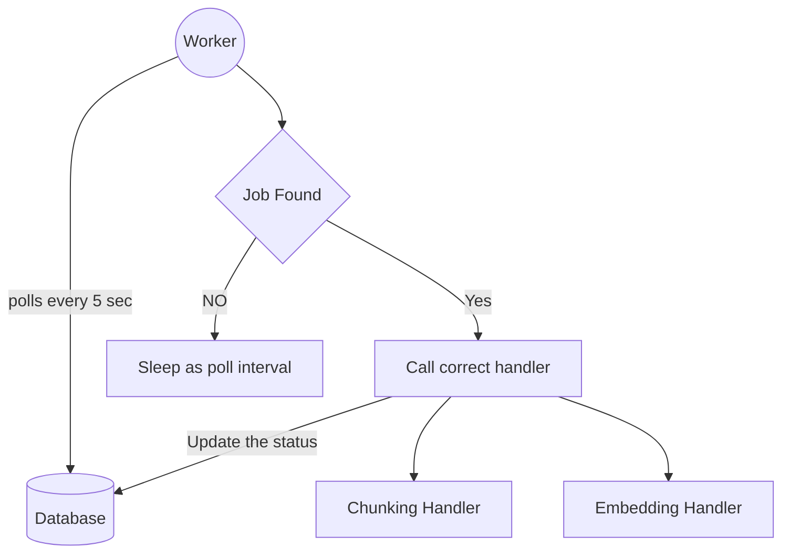

```mermaid
flowchart
    worker((Worker)) --polls every 5 sec--> db[(Database)]
    worker --> jf{Job Found}
    jf --Yes--> handlers[Call correct handler]
    jf --NO--> sleep[Sleep as poll interval]
    handlers --> chunking[Chunking Handler]
    handlers --> embedding[Embedding Handler]
    handlers --Update the status--> db
```
