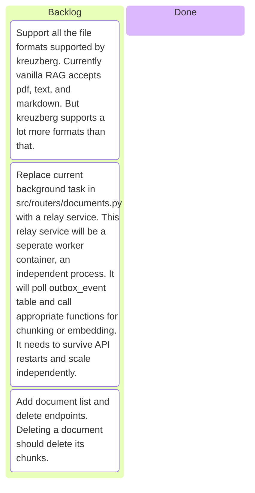

```mermaid
kanban
    Backlog
        t1[Support all the file formats supported by kreuzberg. Currently vanilla RAG accepts pdf, text, and markdown. But kreuzberg supports a lot more formats than that.]

        t2[Replace current background task in src/routers/documents.py with a relay service. This relay service will be a seperate worker container, an independent process. It will poll outbox_event table and call appropriate functions for chunking or embedding. It needs to survive API restarts and scale independently.]

        t3[Add document list and delete endpoints. Deleting a document should delete its chunks.]
    Done
```
